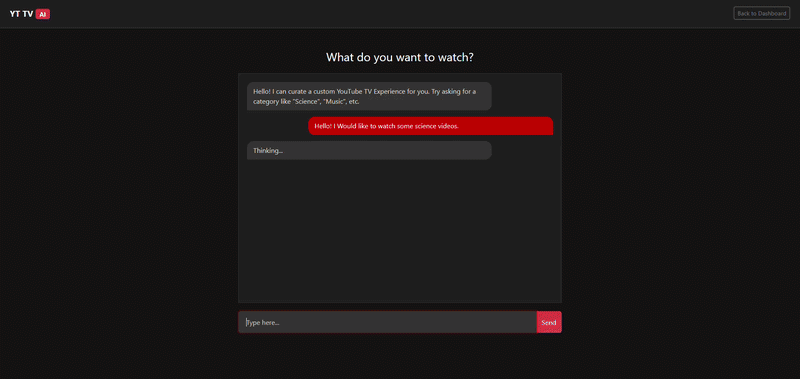
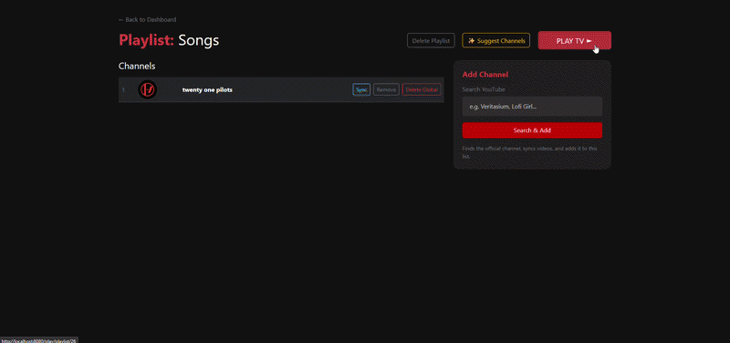
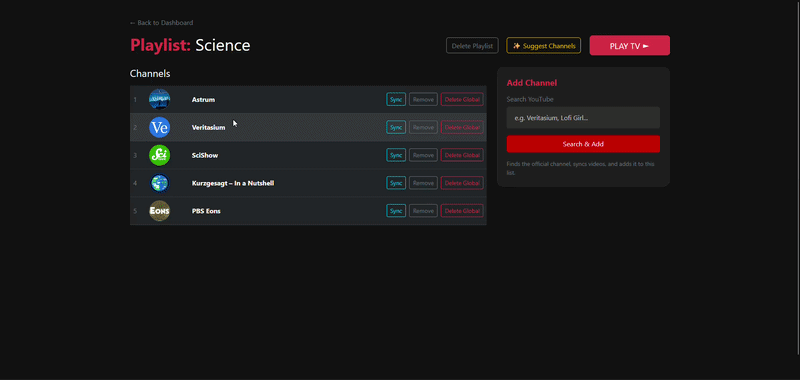
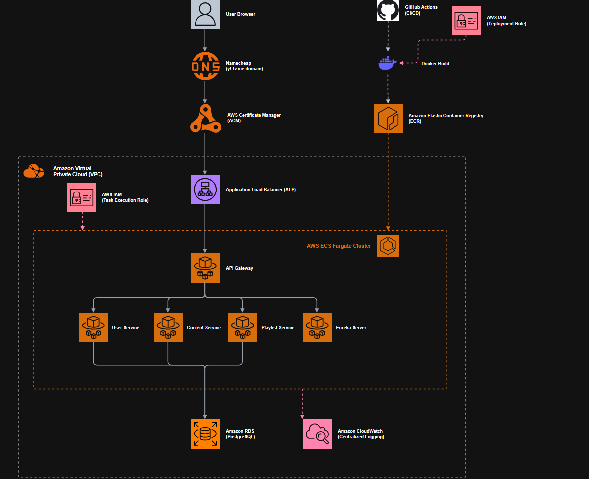

# YT-TV: AI-Driven Video Curation Platform

[](https://openjdk.org/)
[](https://spring.io/projects/spring-boot)
[](https://aws.amazon.com/)
[](https://www.docker.com/)
[](https://github.com/features/actions)

YT-TV is a full-stack video curation platform designed to solve "decision fatigue" on streaming networks. By transforming the active search model into an automated linear TV experience, the platform generates, schedules, and curates thematic broadcast streams.

This project is divided into two distinct architectural segments:
1. A **scalable, secure, distributed microservices backend** deployed on AWS serverless infrastructure.
2. A **local Retrieval-Augmented Generation (RAG) AI engine** using agentic workflows for content curation.

---

## 🎥 Visual Demonstrations

### Agentic AI Chat & Vector Orchestration
The LLM acts as an autonomous system controller. It interprets natural language prompts, intercepts traffic via custom tool definitions, executes vector-store queries, and dynamically builds user playback queues.



### Infinite TV Player
A seamless playback loop that avoids YouTube API limit exhaustion via backend local-cache pagination.



### Dashboard Interface
Responsive dark-mode UI for managing channels and playlist states.



---

## ☁️ Part 1: AWS Cloud Implementation (Core Infrastructure)

This architecture began as a standard Java monolith. To support independent scaling and deployment, I decoupled the application into isolated microservices. Each service was then containerized using Docker, allowing the entire ecosystem to be spun up locally with a single `docker compose up` command.

Because the system is fundamentally built on Docker containers, and security/routing is handled natively by the application code (Spring Security & Eureka) rather than vendor-specific API tools, this architecture is highly **cloud-agnostic**. It can be reconfigured or migrated to any host without rewriting the underlying business logic.

Due to the strict budget constraints of the AWS Student Free Tier, the heavy computational requirements of the LLM and the ChromaDB vector store were intentionally omitted from this cloud deployment. The AI components are conditionally disabled in the cloud environment using Spring's `@Profile("!aws")` annotation.



### 1. Developer Deployment Flow (CI/CD)
The journey from code to cloud is entirely automated to ensure zero-downtime rolling updates:
* **GitHub Actions:** Commits to the main branch trigger a custom `.deploy.yml` workflow. The runner detects changes, executes the Maven build, and packages the microservices into Docker images.
* **AWS IAM (Deployment Role):** The GitHub runner authenticates using a dedicated, programmatic IAM user (`github-ci-deployer`). This user operates strictly on the Principle of Least Privilege, possessing only the specific policies required to push to the registry and update the cluster.
* **Amazon ECR:** The compiled Docker images are pushed to a private Elastic Container Registry, acting as a secure vault for the application binaries.

### 2. Core Infrastructure & Execution (VPC)
The microservices operate within an isolated Virtual Private Cloud (VPC) relying on serverless compute power:
* **Amazon ECS & Fargate:** Rather than managing underlying EC2 virtual machines, the containerized services run on AWS Fargate. Fargate dynamically provisions the exact CPU and memory required for each container instance.
* **Surgical IAM Roles:** Each Fargate task utilizes two distinct roles. The *Task Execution Role* allows the AWS infrastructure to pull images from ECR and send logs to CloudWatch. The *Task Role* is assigned to the running Java code, which is left intentionally restricted to sandbox the application from the broader AWS environment.
* **Data & Configuration:** The core services (User, Content, Playlist) read and write to a centralized **Amazon RDS (PostgreSQL)** database. To prevent hardcoding sensitive credentials (like the Google API Key and DB passwords), environment variables are dynamically injected at runtime using **AWS Secrets Manager**.
* **Observability:** All console outputs and application errors are streamed in real-time to **Amazon CloudWatch** for centralized debugging.

### 3. User Traffic Flow (Ingress)
When a user attempts to access the platform, traffic is securely routed from the public internet down to the private Fargate containers:
* **Namecheap DNS:** The application domain (`yt-tv.me`) was provisioned using the GitHub Student Developer Pack and uses DNS records to point directly to the AWS load balancer.
* **AWS Certificate Manager (ACM):** ACM provisions and manages the SSL/TLS certificates, ensuring that the connection between the user's browser and the application is fully encrypted via HTTPS.
* **Application Load Balancer (ALB):** The ALB sits at the edge of the public subnet. It intercepts the HTTPS traffic, performs SSL termination (decrypting the traffic), and dynamically routes the HTTP requests down to the healthy `gateway-service` container tasks running inside the private ECS cluster. From there, the internal Spring Cloud Gateway and Eureka server take over to route the request to the correct downstream microservice.
---

## 🧠 Part 2: Local Architecture & Agentic AI

The AI categorization and curation features currently operate strictly in a local development environment. When running the platform via local Docker Compose, the full microservice stack boots alongside the AI infrastructure. **The AWS deployment does not communicate with the local AI ecosystem.**

### 1. Local AI Components
* **AI Service (`ai-service`):** A Spring Boot microservice acting as the brain. It utilizes **Spring AI** to communicate with a locally hosted **Llama 3.2** model (via Ollama).
* **Vector Database (ChromaDB):** Hosted locally via Docker. It persists multi-dimensional vector embeddings (`nomic-embed-text`) generated from crawled YouTube metadata for semantic similarity searches.
* **MCP Server (`mcp-server`):** A standalone specialized environment implementing the **Model Context Protocol**. It allows the LLM to directly query the database via secure context tools without exposing or bloating the core application services.

### 2. Retrieval-Augmented Generation (RAG) Pipeline
To make the AI context-aware, I implemented a custom ingestion pipeline:
* **Fetch:** The system pulls channel data via the YouTube Data API v3.
* **Categorize:** A service uses **Llama 3.2** to analyze the channel's recent video titles and auto-tag the channel into a category (Science, Music, Tech, etc.).
* **Embed:** The video metadata and category are embedded using `nomic-embed-text` and stored in ChromaDB.

### 3. Agentic AI ("Nova")
Instead of a simple chatbot, I implemented an Agentic workflow using **Spring AI**.
* **The Brain:** Llama 3.2 (via Ollama).
* **The Logic:** The model is provided with a JSON schema of available tools (e.g., `searchVideos`).
* **The Flow:** When a user types "Show me science videos", the LLM autonomously parses the intent, extracts the "Science" parameter, executes the Java function to query the vector DB, and synthesizes the results into a natural response.
* **Custom MCP Integration:** Built an explicit database context function enabling the LLM to request the exact number of playlists owned by a specific user to resolve complex text-based layout commands.

### 4. AI Engineering Challenges
* **Tool Execution vs. Hallucination:** Standard chatbots hallucinate data. By providing the LLM with a strict JSON schema of available Java functions, the model was forced into an Agentic workflow, autonomously deciding *when* to execute a database query rather than guessing the answers.
* **Data Integrity vs. Vector Search:** Deleting a channel in a relational DB is straightforward, but syncing that state with a Vector DB is complex. I implemented a "Safe Delete" transaction: when a channel is removed, the system clears the relational watch history but retains the Vector data. This enables a "Community Library" feature where content mapped by one user remains semantically discoverable for others.

---

## 🏗️ Proposed Cloud AI Integration

To merge the local AI ecosystem with the AWS cloud environment in the future, three architectural paths are viable:

1. **Containerized Deployment (ECR + EC2):** Similar to the current Spring Boot services, the `ai-service` and a ChromaDB container could be pushed to Amazon ECR. However, running a local Llama 3.2 model requires GPU instances (like AWS EC2 `g4dn` instances) rather than standard serverless Fargate, which significantly increases operating costs.
2. **Managed Cloud Native Services (AWS Bedrock):**
   The most efficient cloud upgrade involves swapping the local Ollama instance for **Amazon Bedrock** (to call Llama 3 via API) and replacing the local ChromaDB container with a managed vector store like **Amazon OpenSearch Serverless**. This removes the need to manage GPU infrastructure entirely.
3. **Hybrid Edge-to-Cloud Routing:**
   The cloud backend could remain on AWS, while the heavy LLM inference runs on local hardware. This is achievable by securely exposing the local `ai-service` via a reverse proxy (like ngrok or Cloudflare Tunnels) or an AWS Site-to-Site VPN, allowing the AWS API Gateway to route specific AI requests back to a local machine.

---

## 🛠️ Complete Technical Stack Breakdown

### Backend Microservices & Core
- **Java 21** - Core development platform leveraging modern language features.
- **Spring Boot 3.4** - Container framework powering the standalone microservice components.
- **Spring Cloud Gateway** - Edge routing controller executing security checks.
- **Spring Cloud Netflix Eureka** - Decentralized runtime service discovery registry.
- **Spring AI** - Integration framework abstraction mapping localized model interactions.

### AI & Data Engineering
- **Llama 3.2** - Localized large language model handled via Ollama runtimes.
- **Model Context Protocol (MCP)** - Secure context transport schema connecting the LLM to structural dependencies.
- **ChromaDB** - Multi-dimensional vector engine handling semantic analytical sets.
- **nomic-embed-text** - Dense tokenization embedding engine maps text parameters.

### Cloud Infrastructure & Operations (AWS & DevOps)
- **AWS ECS Fargate** - Serverless orchestration tier executing continuous container runtimes.
- **Amazon RDS PostgreSQL** - Structured storage system ensuring full ACID transactional compliance.
- **Amazon ECR** - Secure, private image management repository.
- **Application Load Balancer (ALB)** - L7 traffic routing and SSL termination.
- **AWS Certificate Manager (ACM)** - Cryptographic TLS/SSL certificate provisioning.
- **AWS IAM** - Surgical access control and identity governance.
- **Amazon CloudWatch** - Centralized logging and metrics aggregation.
- **GitHub Actions** - Core continuous integration and compilation pipelines.
- **Docker & Docker Compose** - Local unified deployment orchestration wrappers.
---

## 📁 Repository Structure

```text
yt-tv/
├── .github/workflows/         # Automation specifications (GitHub Actions CI/CD)
├── ai-service/                # AI agentic logic and model interaction configurations
├── common/                    # Shared DTOs, security filters, and cross-service utilities
├── content-service/           # Ingestion orchestrators and YouTube integrations
├── eureka-server/             # Netflix Eureka service discovery infrastructure
├── gateway-service/           # Spring Cloud Gateway edge routing and ALB secure routing
├── mcp-server/                # Model Context Protocol server for localized context handling
├── playlist-service/          # Media streams, caching layers, and queue logic
├── screenshots/               # Static assets, architecture diagrams, and demo GIFs
├── user-service/              # Identity management, profile stores, and JWT generation
├── yt-tv-monolith/            # Legacy monolith codebase (pre-migration architecture)
├── docker-compose.yml         # Local microservice cluster runtime definition
├── Dockerfile.microservice    # Standardized multi-stage container build instructions
└── README.md                  # System architectural overview
```

---

## 🚀 How to Run Local Cluster (Full Stack with AI)

### Prerequisites
* **Java 21 JDK**
* **Docker Desktop**
* Valid **Google Cloud Console API Key** (YouTube Data API v3)

*(Note: The provided Docker Compose configuration automatically provisions Postgres, ChromaDB, and automatically pulls the required Llama 3.2 and Nomic models via Ollama).*

### Installation Sequence

1. Clone the repository locally:
   ```bash
    git clone https://github.com/grozeageorge/yt-tv.git
    cd yt-tv
   ```
   
2. Provision the local environment file (.env):
    ```bash
    GOOGLE_API_KEY=your_actual_encrypted_google_api_key
    SPRING_PROFILES_ACTIVE=docker
   ```
 
3. Compile and launch the microservice cluster:
    ```bash
    mvn clean package -DskipTests
    docker compose up -d --build
    ```

## License

This project is open source and available under the [MIT License](LICENSE).

---
*Created by Grozea George*